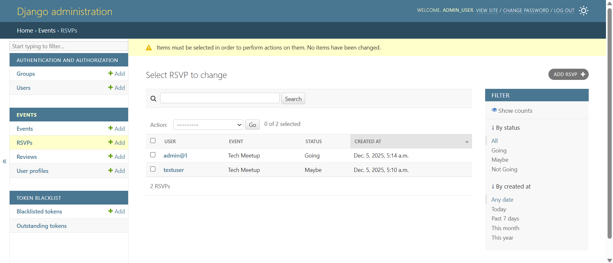
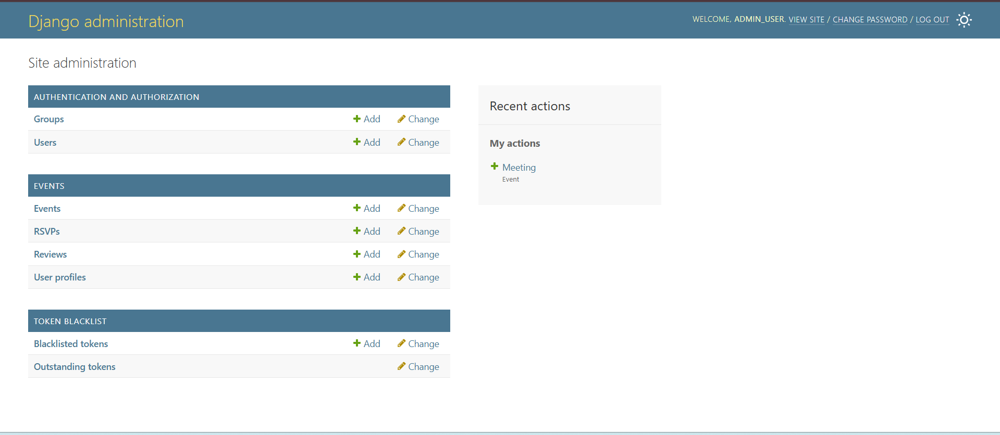
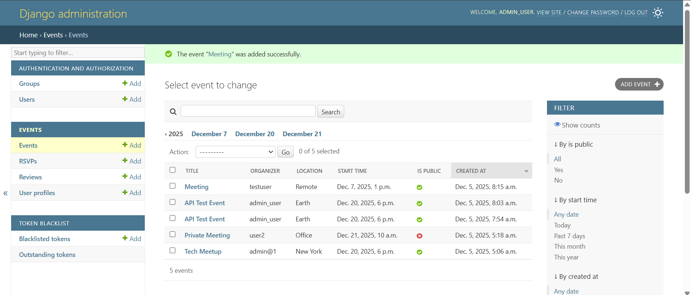
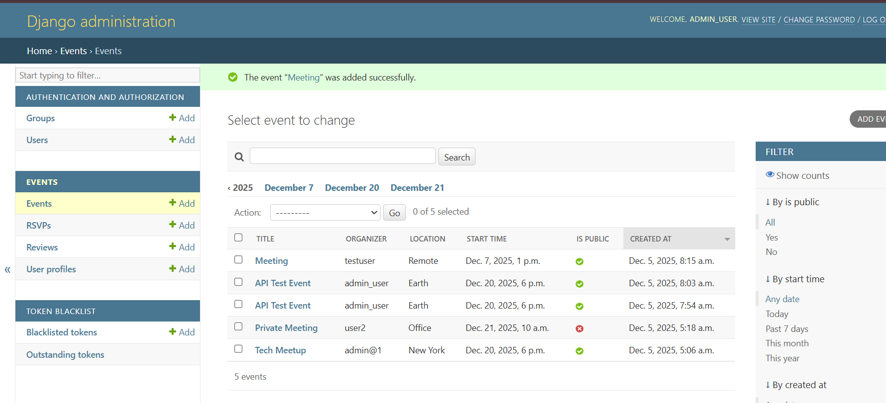
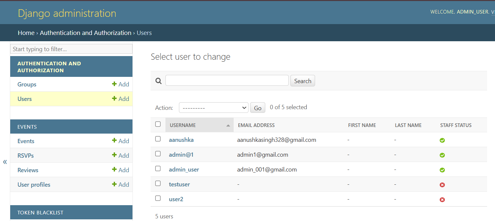

# Event Management API

A Django REST Framework–based API for managing events, RSVPs, and reviews. Users can create events, RSVP to events, and leave reviews for events they have attended.
## Visual Preview of Key Screen

<table>
<tr>
<td></td>
<td></td>
</tr>
<tr>
<td></td>
<td></td>
</tr>
<tr>
<td></td>
<td></td>
</tr>
</table>

---

## Features

- JWT-based authentication  
- Create, update, and delete events  
- RSVP management with status tracking  
- Event reviews with ratings  
- Private and public events  
- Permission-based access control  
- Search, filter, and pagination support  

---

## Sample Superuser Credentials (for demo)

**Username:** `admin_001`  
**Password:** `admin_002`  

---

## Models

### UserProfile
Extends Django's built-in User model with additional fields:

- full_name  
- bio  
- location  
- profile_picture  

### Event

- title  
- description  
- organizer (ForeignKey to User)  
- location  
- start_time  
- end_time  
- is_public (Boolean)  
- created_at  
- updated_at  

### RSVP

- event (ForeignKey to Event)  
- user (ForeignKey to User)  
- status (Going / Maybe / Not Going)  

### Review

- event (ForeignKey to Event)  
- user (ForeignKey to User)  
- rating (1–5)  
- comment  
- created_at  

---

## API Endpoints

### Authentication

| Method | Endpoint           | Description            |
|--------|------------------|------------------------|
| POST   | `/api/token/`     | Obtain JWT token       |
| POST   | `/api/token/refresh/` | Refresh JWT token   |

### Events

| Method | Endpoint                 | Description                 |
|--------|--------------------------|-----------------------------|
| GET    | `/api/events/`           | List all public events (paginated) |
| POST   | `/api/events/`           | Create new event (authenticated) |
| GET    | `/api/events/{id}/`      | Event details              |
| PUT    | `/api/events/{id}/`      | Update event (organizer only) |
| PATCH  | `/api/events/{id}/`      | Partial update (organizer only) |
| DELETE | `/api/events/{id}/`      | Delete event (organizer only) |

### RSVP

| Method | Endpoint                          | Description             |
|--------|----------------------------------|-------------------------|
| POST   | `/api/events/{event_id}/rsvp/`   | RSVP to an event        |
| GET    | `/api/events/{event_id}/rsvp/`   | List RSVPs for an event |
| PATCH  | `/api/events/{event_id}/rsvp/{pk}/` | Update RSVP status |

### Reviews

| Method | Endpoint                            | Description           |
|--------|------------------------------------|-----------------------|
| POST   | `/api/events/{event_id}/reviews/`  | Add a review          |
| GET    | `/api/events/{event_id}/reviews/`  | List reviews for an event |

---

## Setup Instructions

### Prerequisites

- Python 3.8+  
- pip  
- virtualenv (optional but recommended)  

### Installation

```bash
git clone https://github.com/Aanushka001/Event-Management-API.git
cd Event-Management-API
````

Create and activate virtual environment:

```bash
python -m venv venv
source venv/bin/activate   # Windows: venv\Scripts\activate
```

Install dependencies:

```bash
pip install django djangorestframework djangorestframework-simplejwt django-filter pillow
```

Run migrations:

```bash
python manage.py makemigrations
python manage.py migrate
```

Create superuser:

```bash
python manage.py createsuperuser
```

Run development server:

```bash
python manage.py runserver
```

API available at: `http://127.0.0.1:8000/`

---

## Usage Examples

### Obtain JWT Token

```bash
curl -X POST http://127.0.0.1:8000/api/token/ \
  -H "Content-Type: application/json" \
  -d '{"username": "your_username", "password": "your_password"}'
```

### Create an Event

```bash
curl -X POST http://127.0.0.1:8000/api/events/ \
  -H "Authorization: Bearer YOUR_ACCESS_TOKEN" \
  -H "Content-Type: application/json" \
  -d '{
    "title": "Tech Meetup",
    "description": "Monthly tech discussion",
    "location": "New York",
    "start_time": "2025-12-15T18:00:00Z",
    "end_time": "2025-12-15T20:00:00Z",
    "is_public": true
  }'
```

### RSVP to an Event

```bash
curl -X POST http://127.0.0.1:8000/api/events/1/rsvp/ \
  -H "Authorization: Bearer YOUR_ACCESS_TOKEN" \
  -H "Content-Type: application/json" \
  -d '{"status": "Going"}'
```

### Add a Review

```bash
curl -X POST http://127.0.0.1:8000/api/events/1/reviews/ \
  -H "Authorization: Bearer YOUR_ACCESS_TOKEN" \
  -H "Content-Type: application/json" \
  -d '{
    "rating": 5,
    "comment": "Great event!"
  }'
```

---

## Search & Filtering

Search events:

```http
GET /api/events/?search=tech
```

Filter by location:

```http
GET /api/events/?location=New York
```

Filter by public/private:

```http
GET /api/events/?is_public=true
```

Order by start time:

```http
GET /api/events/?ordering=start_time
```

---

## Permissions

* **IsOrganizerOrReadOnly** — Only organizers can edit/delete their events
* **IsInvitedToPrivateEvent** — Only invited users can access private events
* **IsOwnerOrReadOnly** — Users may edit only their own RSVPs and reviews

---

## Testing

```bash
python manage.py test
```

---

## Security Notes

* JWT authentication required for most endpoints
* Private events accessible only to invited users
* Only organizers can modify their events
* Users may modify only their own reviews and RSVPs

---

## Technologies Used

* Django 5.2.9
* Django REST Framework
* djangorestframework-simplejwt
* django-filter
* SQLite (default database)

